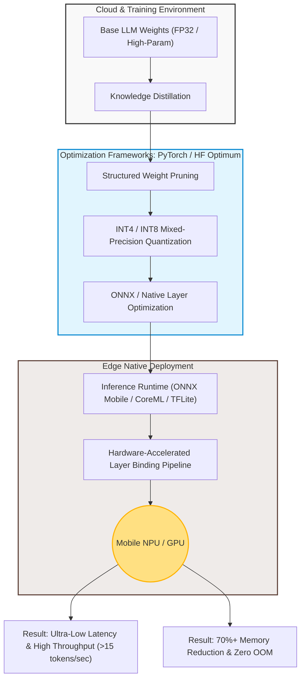

```mermaid
graph TD
    %% Base Model Stage
    subgraph Cloud_Env [Cloud & Training Environment]
        A["Base LLM Weights (FP32 / High-Param)"] --> B["Knowledge Distillation"]
    end

    %% Optimization Stage
    subgraph Opt_Pipeline [Optimization Frameworks: PyTorch / HF Optimum]
        B --> C["Structured Weight Pruning"]
        C --> D["INT4 / INT8 Mixed-Precision Quantization"]
        D --> E["ONNX / Native Layer Optimization"]
    end

    %% Edge Deployment Stage
    subgraph Target_Hardware [Edge Native Deployment]
        E --> F["Inference Runtime (ONNX Mobile / CoreML / TFLite)"]
        F --> G["Hardware-Accelerated Layer Binding Pipeline"]
        G --> H(("Mobile NPU / GPU"))
    end

    %% Performance Metrics
    H --> I["Result: Ultra-Low Latency & High Throughput (>15 tokens/sec)"]
    H --> J["Result: 70%+ Memory Reduction & Zero OOM"]

    %% Styling
    style Cloud_Env fill:#f9f9f9,stroke:#333,stroke-width:2px
    style Opt_Pipeline fill:#e1f5fe,stroke:#0288d1,stroke-width:2px
    style Target_Hardware fill:#efebe9,stroke:#5d4037,stroke-width:2px
    style H fill:#ffe082,stroke:#ffb300,stroke-width:2px
```

