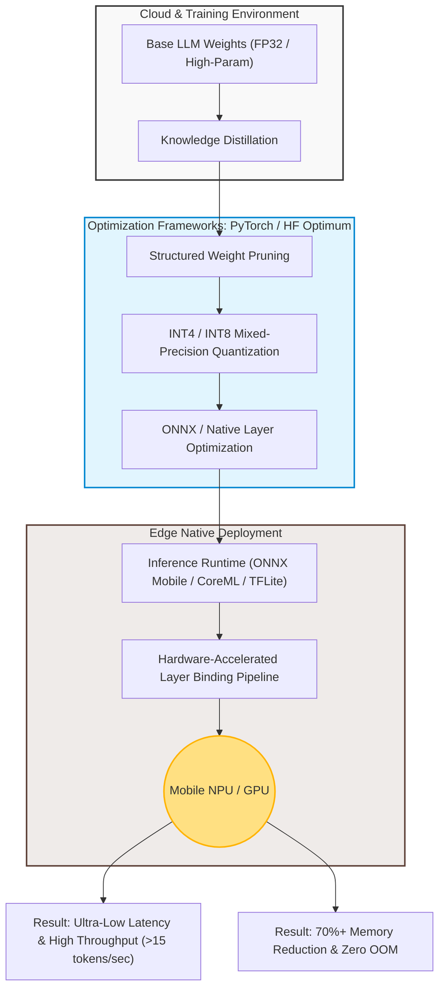

# Production-Grade Edge AI Infrastructure with Quantization-Guided LLM Optimization

An end-to-end edge native deployment pipeline and hardware-aware optimization framework for Small Language Models (SLMs). This project focuses on overcoming strictly bounded hardware constraints (Memory Bandwidth, Compute Limits, Thermal Throttling) to deliver low-latency, cloud-independent local inference.

- **Notice**: The source code of this repository is private and proprietary to protect core intellectual property and business logic. This document serves as a high-level architectural blueprint and technical overview of the production system.

---

## Key Architectural Highlights 
* **Hardware-Aware Infrastructure**: Tailored execution pipelines specifically engineered to maximize the utilization of mobile NPU, GPU, and edge computing runtimes.
* **Zero-Cloud Dependency**: Designed for 100% offline edge execution, eliminating networking bottlenecks, egress costs, and cloud infrastructure overhead.
* **Production-Ready Blueprints**: Complete forward-deployed engineering path migrating complex, high-parameter baseline weights into highly optimized edge-native binaries.

## Tech Stack & Optimization Pipeline
* **Model Baseline**: Customized Small Language Models (SLMs)
* **Optimization Frameworks**: PyTorch, Hugging Face Optimum, ONNX Layer Optimizers
* **Inference Runtimes**: ONNX Runtime Mobile / CoreML / TFLite *(Note: Select your active runtime)*
* **Quantization Matrix**: Post-Training Quantization (PTQ), INT4/INT8 Mixed-Precision, Weight Pruning
* **Target Hardware**: Edge Mobile NPU, Embedded GPU, Arm Cortex Architecture

## Deep Learning Optimization & Engineering Challenges

### 1. Quantization-Guided Compression & Memory Optimization
* **Challenge**: Preventing runtime Out-of-Memory (OOM) errors and minimizing battery drain on consumer edge devices without collapsing language syntax.
* **Solution**: Implemented **INT4/INT8 Mixed-Precision Quantization** alongside structured weight pruning. Reduced the model's memory footprint by over 70% while maintaining perplexity degradation within absolute minimum tolerances.

### 2. Low-Latency Throughput & Execution Binding
* **Challenge**: Accelerating Time-to-First-Token (TTFT) and keeping a sustainable generation throughput under strict thermal throttling limits.
* **Solution**: Developed a hardware-accelerated memory-bound layer binding pipeline. Leveraged device-specific NPU execution providers to guarantee smooth, interactive token-generation throughput (> 15 tokens/sec).

---
*Developed with a focus on Forward-Deployed Deep Learning Infrastructure & Edge Computing.*

